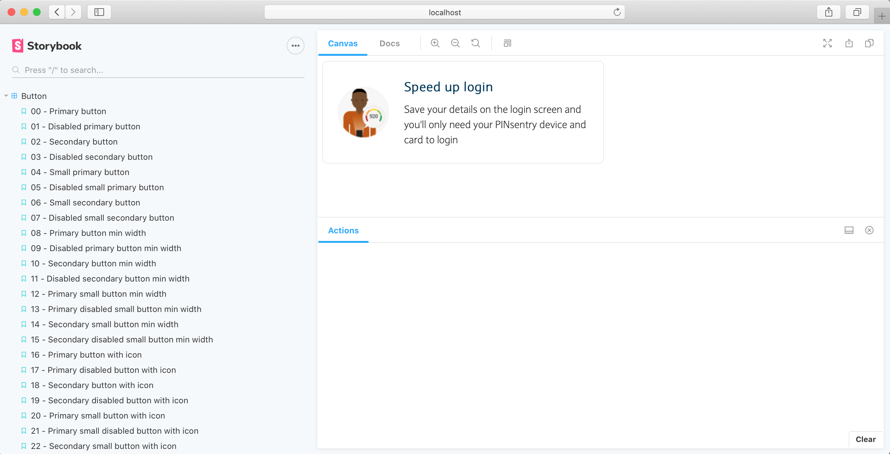
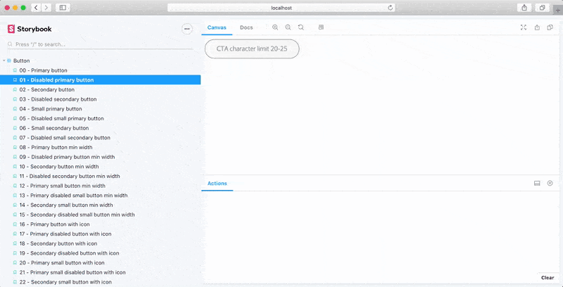
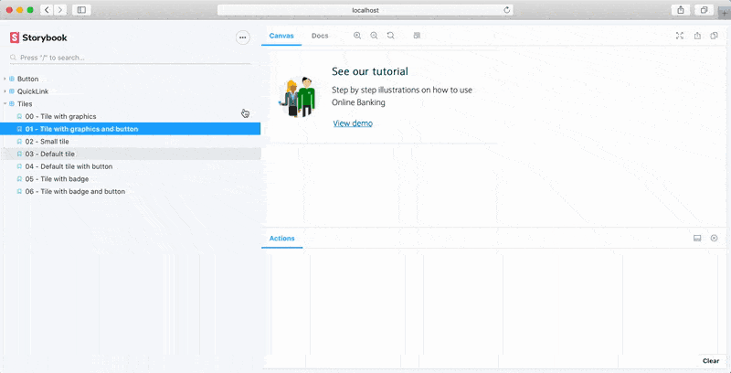
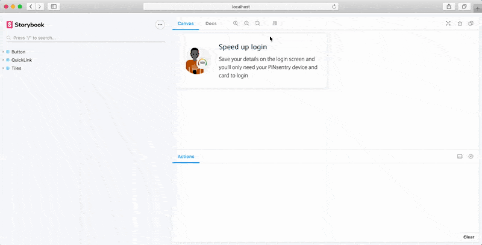
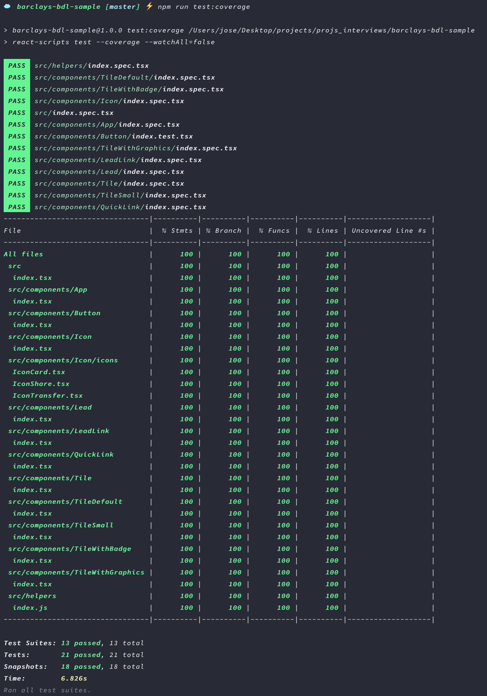
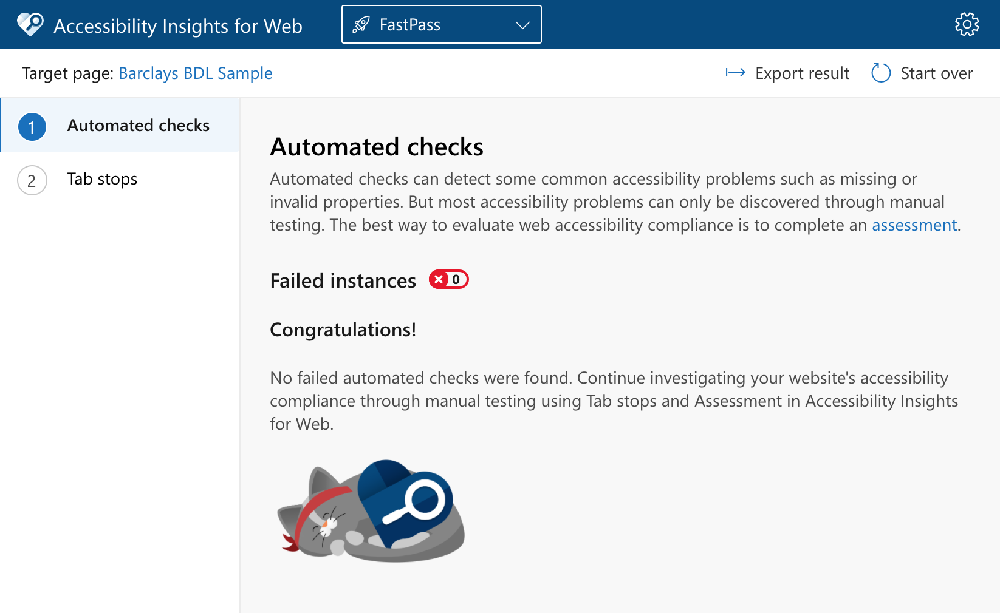

# Barclays BDL Sample

This is a sample of a few hand-picked components from the Barclays Design
Language (BDL)

# Getting started

Ensure you have Node.js installed, although it might work with older versions,
v12.18.1 and above is recommended.

In the root of this project, run the following commands:

```bash
$ npm install
$ npm run storybook
```

If successful, this will open Storybook on your browser, like so:



# About Storybook

From their documentation:

> Storybook is a user interface development environment and playground for UI
> components. The tool enables developers to create components independently and
> showcase components interactively in an isolated development environment."

To make the most out of Storybooks' interactive documentation, a few plugins
were handpicked:

## Actions plugin

This appears at the bottom of each Storybook and acts almost like a browser
console, actions taken in the components, such as clicks, will be logged in the
actions console.



## Docs plugin

To better describe the capabilities of each component, a docs page has been
created. It can be accessed using the docs link at the top of each Storybook and
it will contain a brief introduction of the state of the component being used,
have a foldable code example of how to use it and will contain a full list of
props accepted by the component.



## Viewport plugin

To quickly toggle through different layout sizes, the viewport plugin can be
used. It is accessible via a button at top right of each Storybook.

Designs take a mobile first approach, for illustration and simplicity, a
breakpoint of 768px has been created, any screen narrower than that will be
considered a mobile, anything wider will be considered a desktop.



# Structural testing

Structural testing was achieved with Jest snapshots, every component was
carefully architected to be completely stateless, hence, snapshots alone can
cover all posible structural alternatives.

# Test coverage

Jests' built in Istanbul test coverage tool was used to ensure 100% test
coverage on this project. They are mostly structural tests written in the format
of snapshots (see above), with the exception of a few unit tests for the helper
functions and one spy test for the initial application render.



# Accessibility (A11y) testing

Accessibility tests were covered using
[AccessibilityInsights](https://accessibilityinsights.io) FastPass.



A11y was carried out outside Storybook, the page used to capture it can be
viewed using `$ npm start`

A full assessment was not carried out as most steps do not apply to this
application.

All tiles also have an optional HeaderLevel prop, this is so developers using
this library can adjust the header level to be used without affecting the
headers look and feel. It supports a range from h1 to h6. If no HeaderLevel is
passed in, it will default to h1.

# Notes on visual appearance

Cross environment testing tools such as Happo and Browserstack require payment,
therefore tests were carried out on available devices, covering the following
browsers/OS combinations:

- Google Chrome on OSX
- Mozilla Firefox on OSX
- Opera on OSX
- Safari on OSX
- Safari on iOS
- Google Chrome on iOS

Although not tested, special care was taken to ensure a good browser coverage
and those components might only need minimal adjustments (if any) to render in
the same way on Windows Internet Explorer and Edge.

# Notes on button focus

It's worth noting that different browsers deal with the focus event in different
ways, for this demo:

- Firefox: Behaves exactly as intended, when hovered over, the hover styles
apply, when active, the active styles apply, when tabbed, the tabbed (focused)
styles apply. Hovering away from an active button resets it to its' original
state. To view the tabbed (focused) state, one must actively tab into the button
using the tab key.

- Safari: Behaves exactly as Firefox, except elements cannot be tabbed directly
with the tab key, one must use a combination of option + tab to activate tab
focus.

- Chrome and Opera: Behaves as intended, but an active button is also considered
a tabbed button (focused). To work around it, active styles take precedence over
tabbed styles, it does mean that when hovering away from an active button, the
tabbed styles will remain, this may or may not be the original intention from
the designers, but since it is the default behaviour for those browsers it has
not been # Barclays BDL Sample

This is a sample of a few hand-picked components from the Barclays Design
Language (BDL)

# Getting started

Ensure you have Node.js installed, although it might work with older versions,
v12.18.1 and above is recommended.

In the root of this project, run the following commands:

```bash
$ npm install
$ npm run storybook
```

If successful, this will open Storybook on your browser, like so:


# About Storybook

From their documentation:

> Storybook is a user interface development environment and playground for UI
> components. The tool enables developers to create components independently and
> showcase components interactively in an isolated development environment."

To make the most out of Storybooks' interactive documentation, a few plugins
were handpicked:

## Actions plugin

This appears at the bottom of each Storybook and acts almost like a browser
console, actions taken in the components, such as clicks, will be logged in the
actions console.


## Docs plugin

To better describe the capabilities of each component, a docs page has been
created. It can be accessed using the docs link at the top of each Storybook and
it will contain a brief introduction of the state of the component being used,
have a foldable code example of how to use it and will contain a full list of
props accepted by the component.


## Viewport plugin

To quickly toggle through different layout sizes, the viewport plugin can be
used. It is accessible via a button at top right of each Storybook.

Designs take a mobile first approach, for illustration and simplicity, a
breakpoint of 768px has been created, any screen narrower than that will be
considered a mobile, anything wider will be considered a desktop.


# Structural testing

Structural testing was achieved with Jest snapshots, every component was
carefully architected to be completely stateless, hence, snapshots alone can
cover all possible structural alternatives.

# Test coverage

Jests' built in Istanbul test coverage tool was used to ensure 100% test
coverage on this project. They are mostly structural tests written in the format
of snapshots (see above), with the exception of a few unit tests for the helper
functions and one spy test for the inital application render.


# Accessibility (A11y) testing

Accessibility tests were covered using
[AccessibilityInsights](https://accessibilityinsights.io) FastPass.


A11y was carried out outside Storybook, the page used to capture it can be
viewed using `$ npm start`

A full assessment was not carried out as most steps do not apply to this
application.

All tiles also have an optional HeaderLevel prop, this is so developers using
this library can adjust the header level to be used without affecting the
headers look and feel. It supports a range from h1 to h6. If no HeaderLevel is
passed in, it will default to h1.

# Notes on visual appearance

Cross environment testing tools such as Happo and Browserstack require payment,
therefore tests were carried out on available devices, covering the following
browsers/OS combinations:

- Google Chrome on OSX
- Mozilla Firefox on OSX
- Opera on OSX
- Safari on OSX
- Safari on iOS
- Google Chrome on iOS

Although not tested, special care was taken to ensure a good browser coverage
and those components might only need minimal adjustments (if any) to render in
the same way on Windows Internet Explorer and Edge.

# Notes on button focus

It's worth noting that different browsers deal with the focus event in different
ways, for this demo:

- Firefox: Behaves exactly as intended, when hovered over, the hover styles
apply, when active, the active styles apply, when tabbed, the tabbed (focused)
styles apply. Hovering away from an active button resets it to it's original
state. To view the tabbed (focused) state, one must actively tab into the button
using the tab key.

- Safari: Behaves exactly as Firefox, except elements cannot be tabbed directly
with the tab key, one must use a combination of option + tab to activate tab
focus.

- Chrome and Opera: Behaves as intended, but an active button is also considered
a tabbed button (focused). To work around it, active styles take precedence over
tabbed styles, it does mean that when hovering away from an active button, the
tabbed styles will remain, this may or may not be the original intention from
the designers, but since it is the default behaviour for those browsers it has
not been overriden.
